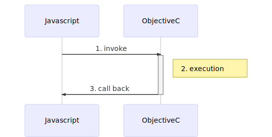

# MHWebBrowser

[](https://travis-ci.org/薛明浩/MHWebBrowser)
[](https://cocoapods.org/pods/MHWebBrowser)
[](https://cocoapods.org/pods/MHWebBrowser)
[](https://cocoapods.org/pods/MHWebBrowser)

## Feature

1. Webkit driven.
2. Indicating of loading status,progress, page title etc.
3. Javascript bridge supported.Javascript can call native sync or async methods in the same way.
4. Friendly API. Both of above are provided by delegate pattern.

## Concepts

### Async



The **async** here has two meanings:
1. The call progress itself is async.That includes the progress 1,2,3 in the diagram above.
2. The method executed in progress 2 can be either async or sync.

### Promise


The calling process is completed by javascript promise. The whole process can be divided into two process.
1. The resolver and rejector is generated by js and stored in cache.
2. The native side(ObjectiveC) do its work and resolve or reject the promise.

## Example

To run the example project, clone the repo, and run `pod install` from the Example directory first.

## Requirements

## Installation

MHWebBrowser is available through [CocoaPods](https://cocoapods.org). To install
it, simply add the following line to your Podfile:

```ruby
pod 'MHWebBrowser', :git => 'git@github.com:Minghao2017/MHWebBrowser.git'
```

## Author

薛明浩, xue_minghao@qq.com

## License

MHWebBrowser is available under the MIT license. See the LICENSE file for more info.
